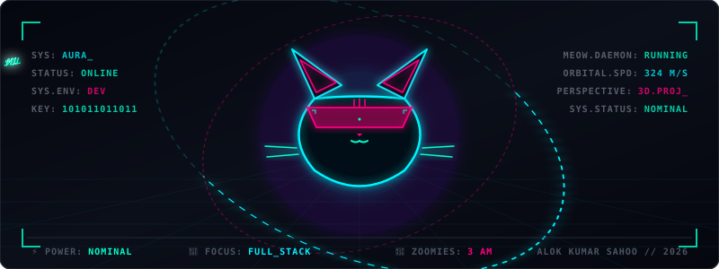

<div align="center">

<!-- Premium Waving Profile Header (Optimized query string to prevent Camo Proxy 404s) -->


<!-- Typing Animation Badge -->
<a href="https://linkedin.com/in/alok-kumar-sahoo1445">
  
</a>

<!-- Quick Contact Badges (Styled with flat-square for modern premium look) -->
<a href="https://linkedin.com/in/alok-kumar-sahoo1445">
  
</a>
<a href="mailto:aloknsahoo@gmail.com">
  
</a>
<a href="https://github.com/FutureAlok1445">
  
</a>

<!-- Animated Neon 3D Cat & HUD Banner -->


<br/>

<!-- Interactive 3D Call to Action -->
<table>
  <tr>
    <td align="center" bgcolor="#0B0F19" style="border: 1.5px solid #00C9FF; border-radius: 8px; padding: 12px;">
      <a href="https://futurealok1445.github.io/3d-portfolio" target="_blank" style="text-decoration: none;">
        <font color="#00FFCC"><b>✨ LAUNCH INTERACTIVE 3D PORTFOLIO ✨</b></font><br/>
        <font color="#8A99AD" size="2">Rotate, drag, zoom, and interact with the 3D workstation &amp; cyber-cat engine in real-time!</font>
      </a>
    </td>
  </tr>
</table>

</div>

<br/>

## 👨‍💻 Profile Summary

*A systems developer and machine learning enthusiast who builds high-throughput microservices, distributed architectures, and predictive analytics models.*

- 🎓 **B.E. in Information Technology** (2023 – 2027) | A.P. Shah Institute of Technology.
- 🏆 **SIH 2025 National Finalist** (Project AURA) & **4x Hackathon Winner** across engineering events.
- 🚀 Lead Architect for **ELMS (Enterprise Logistics Management System)** — a solo-developed microservices platform for real-time logistics tracking and forecasting.
- 🧠 Deep stack experience: Distributed message queues, time-series forecasting, explanations (SHAP/Optuna), and containerized deployments.

---

## 🛠️ Tech Stack & Proficiencies

<div align="center">

| Area | Technologies |
| :--- | :--- |
| **Languages** |  |
| **Frameworks & Databases** |  |
| **Cloud & DevOps** |  |

</div>

---

## 🚀 Key Architectures & Projects

### 📦 [ELMS (Enterprise Logistics Management System)](https://github.com/FutureAlok1445/Logistic-Module)
> **Role:** Solo Architect & Developer | **Stack:** React/TS, Node.js, PostgreSQL, Redis, FastAPI, BullMQ
* An enterprise-grade, distributed logistics ecosystem supporting high-throughput inventory routing and volume forecasting.
```text
[React Frontend] ──> [Node.js Gateway] ──> [BullMQ Worker] ──> [Redis Queue]
                                                │
                                                └──> [FastAPI ML Forecasting]
```
- **Distributed Queuing:** Utilized Redis & BullMQ to offload heavy background logistics compute, reducing API response times by **40%**.
- **ML Forecasting:** Integrated a FastAPI-backed ML microservice using XGBoost to predict seasonal inventory demands with high explainability.

### 🛡️ [FedShield](https://github.com/FutureAlok1445/FedShield)
> **Role:** Lead ML Developer | **Stack:** Python, LightGBM, Flower, Scikit-Learn
* A federated learning model designed to detect credit card fraud across decentralized institutions without sharing raw transactional data.
- **Privacy Assurance:** Implemented differential privacy constraints, achieving a **94.2% ROC-AUC** while maintaining strict cryptographic privacy boundaries.

<details>
<summary>📂 <b>View More Repositories & Utilities</b></summary>

* **[Deepscan](https://github.com/FutureAlok1445/Deepscan):** Deepfake media verification pipeline using EfficientNet-B4 (vision) and DistilBERT (audio/text transcript) with Grad-CAM visual heatmaps.
* **[CreditCardFraudDetection](https://github.com/FutureAlok1445/CreditCardFraudDetection):** Transaction fraud classification model built with Scikit-learn, served via a Flask REST API.
* **[DataTalk-AI](https://github.com/FutureAlok1445/DataTalk-AI):** Conversational LLM interface using LangChain to query SQL databases via natural language.
* **[fincoach-ai](https://github.com/FutureAlok1445/fincoach-ai):** AI-powered financial advisory app analyzing spending patterns and generating personalized savings advice.
* **[HistoFacts-Streamlit](https://github.com/FutureAlok1445/HistoFacts-Streamlit):** Event aggregation dashboard pulling historical metadata and presenting interactive charts.
* **[SpaceScope](https://github.com/FutureAlok1445/SpaceScope):** Visual telescope data aggregator mapping planetary transits and stellar telemetry.
</details>

---

## 💼 Experience

### **Software Engineer Intern**
**IMS Learning Resources Pvt. Ltd.** | *Feb 2026 – May 2026*
- Redesigned core pages of the React.js student analytical dashboard, optimizing client-side caching and reducing page load times by **35%**.
- Programmed analytics REST APIs in Node.js, facilitating low-latency score queries for over 50,000 active mock-test users.

### **Software Engineer Intern**
**Sapphire Infocom Pvt. Ltd.** | *Dec 2025 – Feb 2026*
- Led the backend design for the campus networking platform *Swish*, implementing secure JWT-based stateless authentication and RBAC.
- Designed media optimization pipelines utilizing Cloudinary CDN, reducing asset delivery latencies by **50%**.

---

## 🏆 Hackathon Victories & Certifications

<div align="center">

| Award | Event / Issuer | Details |
| :--- | :--- | :--- |
| **🏅 National Finalist** | Smart India Hackathon (SIH) 2025 | Developed **Project AURA** (Decentralized Governance Dashboard) |
| **🥇 Winner** | OpsStorm Hackathon | Automated container orchestration recovery systems |
| **🥇 Winner** | IEEE Hackathon | Designed a real-time decentralized verification ledger |
| **📜 Certification** | Google Cloud (GCP) | Generative AI Fundamentals |
| **📜 Certification** | NPTEL | Elite Certificate in Database Management Systems (Top 5%) |

</div>

---

## 📊 GitHub Analytics

<div align="center">

<!-- Custom-themed Stats Cards using matching dark-neon cyberpunk theme colors -->
<table border="0">
  <tr>
    <td align="center">
      
    </td>
    <td align="center">
      
    </td>
  </tr>
</table>

<br/>


</div>

<br/>

<div align="center">

<!-- Waving Footer -->


**⭐ Let's connect and build the future of software engineering!**

</div>
