<div align="center">

<!-- Hero Banner (Cyberpunk Workstation + Neon Cat) -->
<a href="https://github.com/FutureAlok1445">
  
</a>

<br/>

<!-- Typing SVG: Job Titles & Passion -->
<a href="https://linkedin.com/in/alok-kumar-sahoo1445">
  
</a>

<br/>

<!-- Neon Social Badges -->
<a href="https://linkedin.com/in/alok-kumar-sahoo1445"></a>
<a href="mailto:aloknsahoo@gmail.com"></a>
<a href="https://github.com/FutureAlok1445"></a>
<a href="#"></a>

<br/><br/>

</div>

---

<div align="center">

## 👨‍💻 _`root@alok:~# whoami`_

<table border="0">
  <tr>
    <td align="left" bgcolor="#0B0F19" style="border: 1px solid #00F2FE; border-radius: 8px; padding: 15px;">
      <font color="#00F2FE"><b>&gt; EXECUTIVE_SUMMARY:</b></font><br/>
      <font color="#94A3B8">I am a Software Engineer and Systems Architect obsessed with high-throughput microservices, artificial intelligence, and beautifully crafted UI/UX. Currently pursuing my B.E. in Information Technology (2023–2027) at A.P. Shah Institute of Technology.</font><br/><br/>
      <font color="#FF007F"><b>&gt; MISSION_DIRECTIVE:</b></font><br/>
      <font color="#94A3B8">To build scalable, privacy-preserving distributed systems that bridge the gap between elegant frontend interfaces and highly complex backend machine learning models.</font>
    </td>
  </tr>
</table>

</div>

---

## ⚡ _`sys.modules.load("SKILLS")`_

<div align="center">

### `[ FRONTEND // UI // UX ]`


### `[ BACKEND // DB // API ]`


### `[ DEVOPS // CLOUD // AI ]`


</div>

---

## 📊 _`metrics.visualize()`_

<div align="center">

<table border="0">
  <tr>
    <!-- Main Stats -->
    <td align="center">
      
    </td>
    <!-- Top Languages -->
    <td align="center">
      
    </td>
  </tr>
</table>


<br/>
<br/>

<!-- Contribution Snake -->
<picture>
  <source media="(prefers-color-scheme: dark)" srcset="https://raw.githubusercontent.com/FutureAlok1445/FutureAlok1445/output/github-contribution-grid-snake-dark.svg">
  <source media="(prefers-color-scheme: light)" srcset="https://raw.githubusercontent.com/FutureAlok1445/FutureAlok1445/output/github-contribution-grid-snake.svg">
  
</picture>

</div>

---

## 🚀 _`core.execute("FEATURED_PROJECTS")`_

<table border="0">
  <tr>
    <td width="50%" valign="top">
      <h3 align="center"><font color="#00F2FE">📦 ELMS (Enterprise Logistics)</font></h3>
      <p align="center"> </p>
      <p><font color="#94A3B8">A solo-developed enterprise-grade distributed microservices platform for real-time logistics tracking and ML-based volume forecasting. Features Redis &amp; BullMQ distributed queuing.</font></p>
      <p align="center"><a href="https://github.com/FutureAlok1445/Logistic-Module"><b>[ SOURCE CODE ]</b></a></p>
    </td>
    <td width="50%" valign="top">
      <h3 align="center"><font color="#FF007F">🛡️ FedShield</font></h3>
      <p align="center"> </p>
      <p><font color="#94A3B8">A federated learning model utilizing differential privacy to detect credit card fraud across decentralized institutions without sharing raw transactional data. Achieved 94.2% ROC-AUC.</font></p>
      <p align="center"><a href="https://github.com/FutureAlok1445/FedShield"><b>[ SOURCE CODE ]</b></a></p>
    </td>
  </tr>
</table>

---

## 🏆 _`system.achievements()`_

- 🏅 **National Finalist:** Smart India Hackathon (SIH) 2025 (Project AURA - Decentralized Governance).
- 🥇 **Winner:** OpsStorm Hackathon (Automated Container Orchestration Recovery).
- 🥇 **Winner:** IEEE Hackathon (Decentralized Verification Ledger).
- 📜 **Certified:** Google Cloud (GCP) Generative AI Fundamentals.

---

## 🧠 _`thread.spawn("LEARNING_ROUTINE")`_

```bash
[========================>  ] 85%  Advanced Three.js / WebGL Rendering
[=================>         ] 60%  Kubernetes Orchestration & Helm Charts
[========>                  ] 30%  Rust for High-Performance Systems
```

---

<div align="center">

## 🔮 _`print(daily_quote)`_


<br/><br/>

<!-- Cyberpunk Footer Divider & Skyline -->


**[ CONNECTION TERMINATED ] // Thank you for visiting the Mainframe.**

</div>
