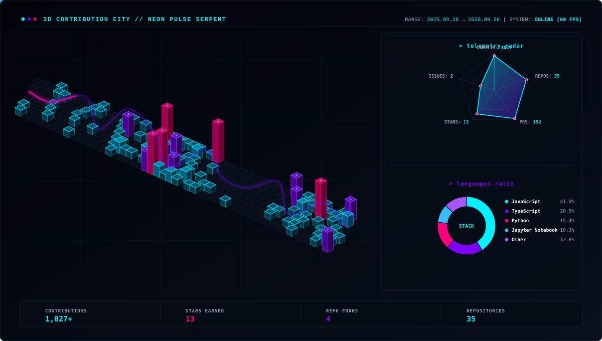

<div align="center">

<!-- Hero Banner -->
<a href="https://github.com/FutureAlok1445">
  
</a>

<br/>

<!-- Dynamic Title Typing Animation -->


<br/>

<!-- Real-time Profile Counters -->
<a href="https://github.com/FutureAlok1445">
  
</a>
<a href="https://github.com/FutureAlok1445?tab=followers">
  
</a>

<br/><br/>

<!-- Social & Contact Badges -->
<a href="https://linkedin.com/in/alok-kumar-sahoo1445">
  
</a>
<a href="mailto:aloknsahoo@gmail.com">
  
</a>
<a href="https://github.com/FutureAlok1445">
  
</a>

</div>

---

<div align="center">

## `root@alok:~$ whoami`

</div>

```yaml
identity:
  name: Alok Kumar Sahoo
  role: Software Engineer & Full-Stack Systems Architect
  education: B.E. in Information Technology (2023 – 2027)
  institution: A.P. Shah Institute of Technology

core_competencies:
  - High-Throughput Full-Stack Web Applications
  - Applied AI & Explainable Machine Learning
  - Distributed Backend Microservices & Asynchronous Queues
  - Cloud Infrastructure, Containerization & CI/CD Pipelines

mission_directive: >
  Architect scalable, intelligent, and beautifully engineered
  software systems that bridge intuitive UI/UX with resilient backend pipelines.
```

<br/>

<div align="center">

> `Code. Build. Break. Learn. Improve. Repeat.`

</div>

---

## `> tech_stack --load`

<div align="center">

### `Frontend / UI & Design`


<br/>

### `Backend / APIs / Databases`


<br/>

### `Cloud / DevOps / Infrastructure`


<br/>

### `AI / Machine Learning`


</div>

---

## `> projects --featured`

<table border="0" width="100%">
<tr>
<td width="50%" valign="top">

### 🛡️ TrustNet-AI

An explainable digital-deception and media verification platform targeting synthetic faces and manipulated images.

- **Problem:** Black-box AI detectors provide no inspectable evidence for human analysts.
- **Approach:** Combines Vision Transformers (ViT) and EfficientNet spatial backbones with 2D FFT, Error Level Analysis (ELA), and sensor-noise forensics with Grad-CAM visual heatmaps.
- **Stack:** `Python` • `FastAPI` • `React` • `PyTorch` • `ViT` • `OpenCV` • `Docker`

<br/>

<a href="https://github.com/FutureAlok1445/Deepscan">
  
</a>

</td>

<td width="50%" valign="top">

### 💸 Reimbursement Automation System

An institutional multi-role workflow platform streamlining academic expense submissions, verification, and disbursement.

- **Problem:** Manual paper-based reimbursement queues suffer from verification delays and lack of audit trails.
- **Approach:** Full-stack role-based workflow across 5 tiers (Student/Faculty → Coordinator → HOD → Principal → Accounts) with automated approvals.
- **Stack:** `React` • `Vite` • `Node.js` • `Express.js` • `PostgreSQL` • `REST APIs`

<br/>

<a href="https://github.com/FutureAlok1445/reimbursement-automation-system">
  
</a>

</td>
</tr>

<tr>
<td width="50%" valign="top">

### 🏛️ HistoFacts

AI-powered historical education platform featuring multiplayer WebSocket quizzes, study notes generation, and a token reward economy.

- **Problem:** Traditional history learning is static, text-heavy, and lacks engaging peer-to-peer competition.
- **Approach:** Real-time Kahoot-style quiz lobbies via WebSockets, Wikimedia historical event sync, and LLM-powered PDF curriculum study note generation.
- **Stack:** `React 19` • `FastAPI` • `PostgreSQL 16` • `WebSocket` • `Docker` • `Tailwind CSS`

<br/>

<a href="https://github.com/FutureAlok1445/HistoFacts">
  
</a>

</td>

<td width="50%" valign="top">

### 🛡️ SIH AURA (Advanced URL Response Analyzer)

National Finalist platform built for Smart India Hackathon (SIH) 2025 for forensic PCAP and IPDR network analysis.

- **Problem:** Security analysts struggle to distinguish between benign attack attempts and confirmed network breaches.
- **Approach:** Forensic network packet triage with interactive 3D threat topology visualizations and curated traffic dataset exploration.
- **Stack:** `React 19` • `Vite 7` • `Tailwind CSS` • `Python` • `Three.js` • `Kibana`

<br/>

<a href="https://github.com/FutureAlok1445/Advanced-URL-Response-Analyzer-SIH2025">
  
</a>

</td>
</tr>
</table>

---

<div align="center">

## 🏆 _`system.trophies()`_


</div>

---

<div align="center">

## `> github.metrics()`

<table border="0" width="100%">
  <tr>
    <td align="center" width="50%">
      
    </td>
    <td align="center" width="50%">
      
    </td>
  </tr>
</table>

<br/>


</div>

---

<div align="center">

## 🌆 My Contribution City
<i>Every commit builds another tower — and a neon pulse carries the city's energy.</i>
<br/><br/>


</div>

---

## `> system.highlights()`

- 🏅 **National Finalist — Smart India Hackathon (SIH) 2025** (Project AURA - Advanced URL Response Analyzer).
- 🥇 **Winner — OpsStorm Hackathon** (Automated Container Orchestration & Self-Healing Services).
- 🥇 **Winner — IEEE Hackathon** (Decentralized Verification Ledger).
- ☁️ **Certified — Google Cloud Platform (GCP)** Generative AI Fundamentals.
- 🧠 Active Developer across **Distributed Backend Architectures, ML Pipelines & Frontend Engineering**.
- ⚙️ Focused on engineering systems that are **fault-tolerant, latency-optimized, and secure**.

---

<div align="center">

## `> developer.mindset()`



<br/><br/>


### `[ CONNECTION CLOSED ]`

**Thanks for visiting my GitHub profile.**

</div>
